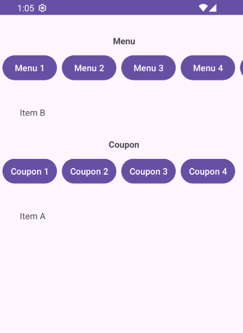
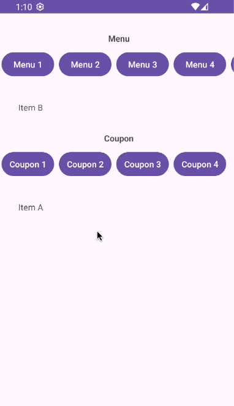
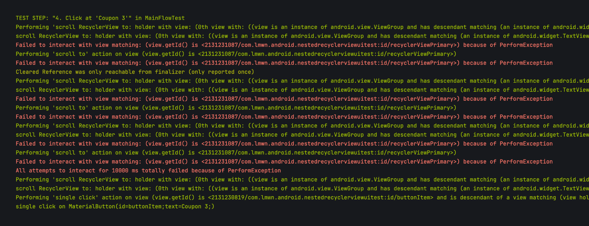

# "Scroll To" issue in Android UI Test

A sample project for the issue where `scrollTo` in `childWith` does not work, requiring a 10-second timeout before proceeding to the next step.

Here is what my sample app looks like 👇

What I expect in UI test 👇

The issue occurs in the step called `Click at 'Coupon 3'`, where Kakao does not immediately click the button but waits for the 10-second timeout from the `scrollTo` command inside `childWith`.

In the step called `Click at 'Menu 8'`, it cannot do horizontal scroll `recyclerViewSecondary` to 'Menu 8' button and causing the UI test to fail.
